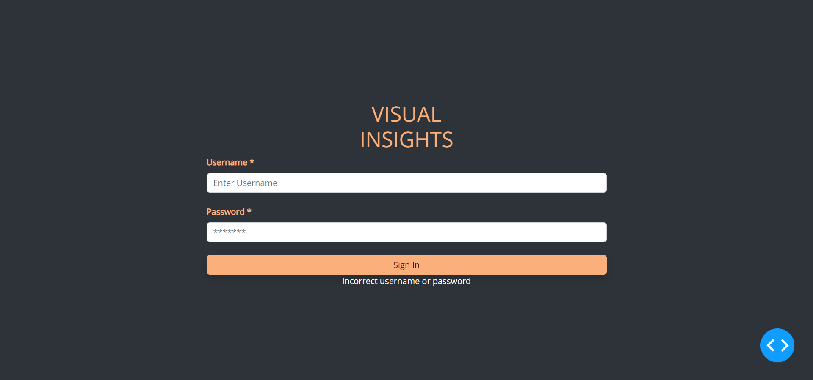
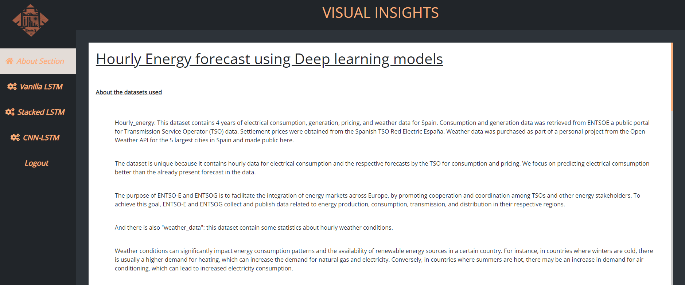
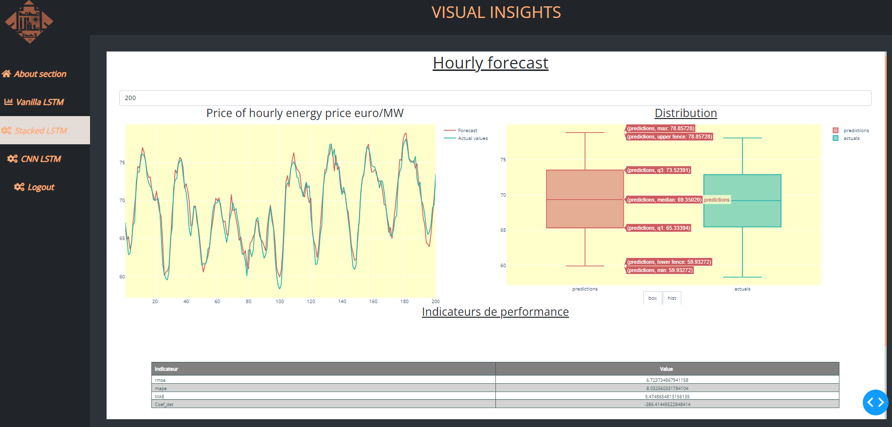
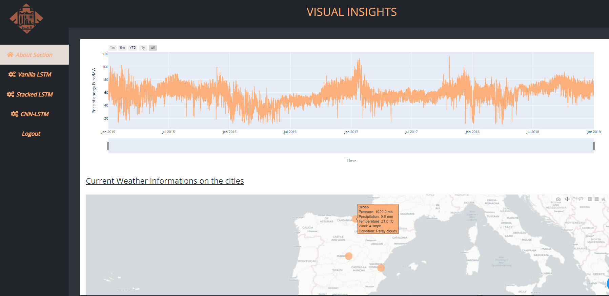
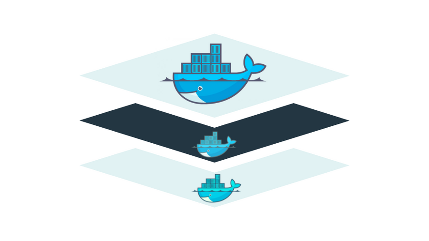

# Visual-Insights

- In this application we tried to deploy deep learning models for time series forecasting .
- This Forecast concerns the prediction of energy price in the region of spain using time series models .
- The models are  : vanilla LSTM , stacked LSTM , the combination of LSTM and CNN model (Hybrid), The goal was to compare between the performance of these models .
- The Application Visual insights represent an interface in which we integrated these models , to make predictions and make comparison .
- It is built using dash plotly  for better interactivity.
- We tried to manipulate the architecture of dash by working on the flask layer  to use a multipage model for good user experience ,  and add an authentification system  using Mysql database ,SQLAlchemy, Flask login  for this purpose .

 

 

 

- This project was dockerized and decomposed into microservices using Tensorflow Serving , Mysql , and The web interface .

 

- The each component has it's own dockerfile,configuration(secrets ..) , yaml file .

- The whole architecture can be deployed as a kubernetes cluster . 

 

